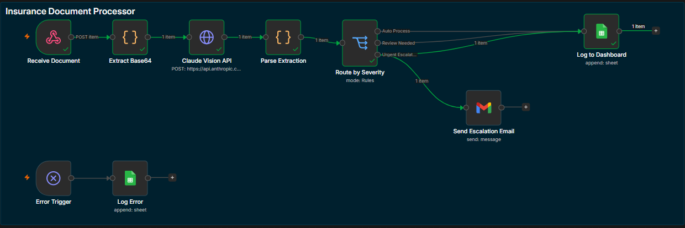
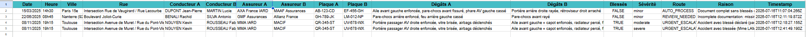
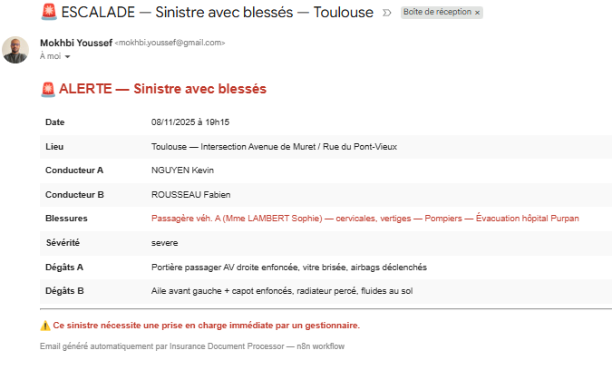

# 🔴 Insurance Document Processor

An intelligent document processing pipeline that automates the extraction, classification, and routing of French automobile insurance claims (Constat Amiable) using Claude Vision API and n8n workflow automation.

## The Problem

In traditional insurance workflows, claims adjusters manually read scanned accident reports, extract data field by field, enter it into the system, and decide on the appropriate processing route. This process is slow, error-prone, and doesn't scale.

## The Solution

This project automates the entire pipeline: a scanned accident report (PDF/image) is sent to a webhook, Claude Vision API reads and extracts 15+ structured fields, business logic classifies the claim by severity and completeness, and the system routes it to the appropriate processing track — all in seconds.

## Workflow



## Architecture

```
POST /webhook ──► Extract ──► Claude Vision ──► Parse JSON ──► Route by Severity
  (PDF/image)     Base64       API (Haiku)      Extraction    ┌──────────────────┐
                                                              │ AUTO_PROCESS      │──► Google Sheets
                                                              │ REVIEW_NEEDED     │──► Google Sheets
                                                              │ URGENT_ESCALATION │──► Google Sheets + Email Alert
                                                              └──────────────────┘
                                                              Error Trigger ──► Error Log (Google Sheets)
```

## How It Works

**1. Document Ingestion** — A scanned Constat Amiable (PDF or image) is sent via POST request to the n8n webhook endpoint.

**2. Vision-Based Extraction** — Claude Vision API reads the document visually (no traditional OCR) and extracts structured data into a JSON object: accident details (date, time, location), both drivers' information (name, address, phone, license), insurance details (company, policy number, green card), vehicle information, damages, circumstances, and injury declarations.

**3. Business Logic Classification** — The extracted data is analyzed through three classification rules:
- **Severity assessment**: minor / moderate / severe — based on damage extent, airbag deployment, emergency services involvement
- **Completeness check**: validates that all critical fields are present (driver names, insurance numbers, signatures)
- **Injury detection**: flags any declared injuries for priority handling

**4. Intelligent Routing** — Based on classification, each claim is routed to the appropriate track:

| Route | Trigger | Action |
|-------|---------|--------|
| `AUTO_PROCESS` | Complete document, no injuries | Logged to Google Sheets dashboard |
| `REVIEW_NEEDED` | Missing critical fields | Logged with flag for human review |
| `URGENT_ESCALATION` | Injuries declared | Logged + automatic email alert sent |

**5. Error Handling** — Any pipeline failure is caught by a dedicated error trigger and logged to a separate error tracking sheet with timestamp, failing node, and error message.

## Screenshots

### Claims Dashboard (Google Sheets)


### Escalation Email (Injuries Detected)


## Extraction Schema

Claude Vision extracts the following fields from each document:

```json
{
  "accident": { "date", "time", "location": { "country", "city", "street" } },
  "injuries": { "declared", "details" },
  "vehicle_a": {
    "driver": { "last_name", "first_name", "address", "phone", "license_number", "license_date" },
    "insurance": { "company", "policy_number", "green_card_number", "validity_period" },
    "vehicle": { "make_model", "plate_number" },
    "damages", "signature_present"
  },
  "vehicle_b": { "...same structure as vehicle_a..." },
  "circumstances": { "vehicle_a": [], "vehicle_b": [] },
  "completeness": { "is_complete", "missing_fields": [] },
  "classification": { "severity", "has_injuries", "route", "route_reason" }
}
```

## Key Engineering Decisions

**Claude Vision API vs Traditional OCR** — Traditional OCR tools (Tesseract, Google Vision) output raw text that requires extensive post-processing to reconstruct document structure. Claude Vision reads the document as a human would — understanding layout, checkboxes, columns, and context simultaneously — and returns structured data directly. This eliminates an entire parsing layer and handles handwritten text more reliably.

**Haiku for Development, Sonnet for Production** — During development, Claude Haiku was used for fast iteration at lower cost. The extraction quality was evaluated against all three test cases, and Haiku proved sufficient for typed/digital documents. For production use with handwritten or degraded scans, Sonnet would provide higher extraction accuracy. This cost/quality tradeoff is a deliberate architecture choice.

**Routing Logic in the Prompt vs in n8n** — The classification logic (severity, completeness, routing decision) is embedded in the Claude prompt rather than implemented as separate n8n logic nodes. This keeps the workflow simple and lets Claude leverage contextual understanding (e.g., "airbags deployed" implies severity) that would require complex rule chains in n8n. The n8n Switch node then simply reads Claude's routing decision.

**Google Sheets as Output** — For this portfolio project, Google Sheets serves as a lightweight dashboard that demonstrates the end-to-end flow visually. In production, this would connect to a claims management system (like Guidewire ClaimCenter) via REST API.

## Tech Stack

| Component | Technology |
|-----------|-----------|
| Workflow orchestration | n8n (self-hosted, Community Edition) |
| Document analysis | Claude Vision API (Anthropic) |
| Prompt engineering | Structured extraction prompt (Role/Task/Input/Output/Constraints) |
| Data output | Google Sheets API (OAuth2) |
| Email alerts | Gmail API (OAuth2) |
| Testing | Postman |

## Project Structure

```
insurance-document-processor/
├── README.md
├── workflow.json                    # n8n workflow (importable)
├── prompts/
│   └── document_analyzer.md         # Claude Vision extraction prompt
├── sample-docs/
│   ├── constat_cas1_complet.pdf      # Complete case → AUTO_PROCESS
│   ├── constat_cas2_incomplet.pdf    # Incomplete case → REVIEW_NEEDED
│   └── constat_cas3_blesses.pdf      # Injuries case → URGENT_ESCALATION
└── screenshots/
    ├── workflow_canvas.png           # n8n workflow overview
    ├── google_sheets_dashboard.png   # Claims dashboard output
    └── escalation_email.png         # Automated email alert
```

## Setup & Run

### Prerequisites
- Node.js (v18+)
- n8n installed globally (`npm install n8n -g`)
- Anthropic API key with credits
- Google Cloud project with Sheets API and Gmail API enabled

### Installation

1. Clone the repository:
```bash
git clone https://github.com/youssefmkb/insurance-document-processor.git
cd insurance-document-processor
```

2. Start n8n:
```bash
n8n start
```

3. Import the workflow:
   - Open `http://localhost:5678`
   - Go to **Workflows → Import from File**
   - Select `workflow.json`

4. Configure credentials:
   - **Claude API**: Add HTTP Header Auth credential with your `x-api-key`
   - **Google Sheets**: Connect OAuth2 with Sheets API enabled
   - **Gmail**: Connect OAuth2 with Gmail API enabled

5. Create the Google Sheet:
   - Create a spreadsheet named `Insurance Claims Dashboard`
   - Sheet `Claims` with columns: Date | Heure | Ville | Rue | Conducteur A | Conducteur B | Assureur A | Assureur B | Plaque A | Plaque B | Dégâts A | Dégâts B | Blessés | Sévérité | Route | Raison | Timestamp
   - Sheet `Errors` with columns: Timestamp | Node | Error Message

6. Test with Postman:
```bash
POST http://localhost:5678/webhook/process-claim
Body: form-data → key "data" (File) → select a PDF from sample-docs/
```

## Test Results

| Document | Expected Route | Result | Sheet | Email |
|----------|---------------|--------|-------|-------|
| `constat_cas1_complet.pdf` | AUTO_PROCESS | ✅ | ✅ | — |
| `constat_cas2_incomplet.pdf` | REVIEW_NEEDED | ✅ | ✅ | — |
| `constat_cas3_blesses.pdf` | URGENT_ESCALATION | ✅ | ✅ | ✅ |

## Future Improvements

- **Multi-document support** — Handle other insurance documents (déclaration de sinistre, expertise report, devis de réparation) with document type auto-detection
- **Confidence scoring** — Add extraction confidence scores per field, flagging low-confidence values for human verification
- **Handwritten document support** — Upgrade to Claude Sonnet for better accuracy on handwritten and degraded scans
- **Database storage** — Replace Google Sheets with PostgreSQL for production-grade data persistence
- **REST API integration** — Connect output to a claims management system (e.g., Guidewire ClaimCenter) via REST API
- **Dashboard UI** — Build a React frontend to visualize claims status, filters, and statistics in real-time

## Context

This project is the AI-powered version of work I did at **AXA France** as a Guidewire ClaimCenter developer, where I built EDI broker flows (506/508/509) for automated claim creation and modification. The routing logic in this project — classifying documents and deciding whether to process, flag for review, or escalate — mirrors the blocking/unblocking mechanism I implemented for incoming EDI flows at AXA.

The difference: at AXA, the data was manually entered before reaching the system. Here, the AI handles the extraction from the raw document.

## Author

**Youssef Mokhbi** — AI Automation & Integration Engineer

- LinkedIn: [linkedin.com/in/youssef-mokhbi-654a9b10a](https://linkedin.com/in/youssef-mokhbi-654a9b10a)
- GitHub: [github.com/youssefmkb](https://github.com/youssefmkb)
